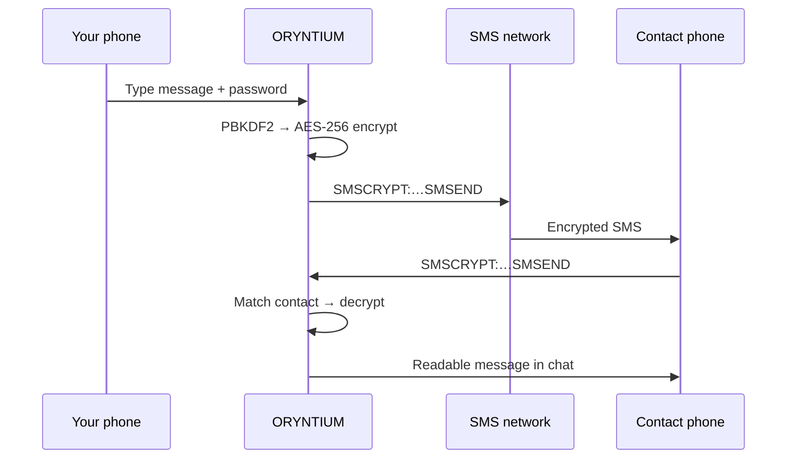
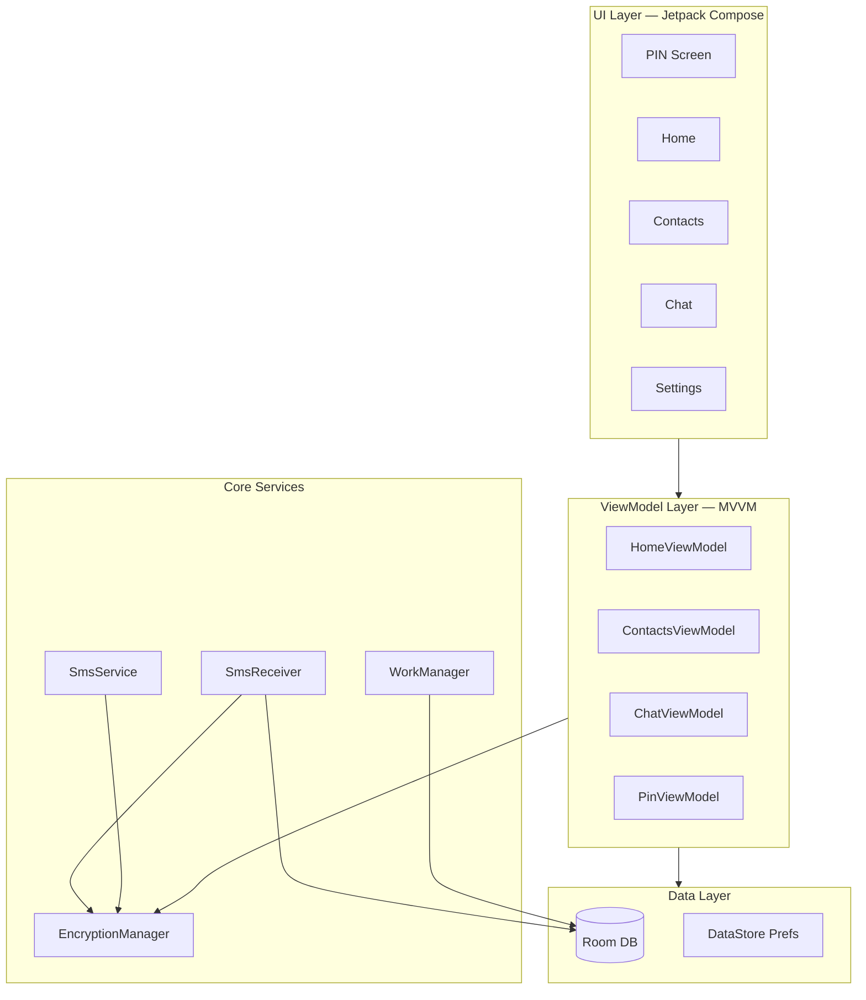

<div align="center">


# ORYNTIUM

### Secure SMS Encryption for Android

**Keep it yours.** Military-grade AES-256 messaging with per-contact passwords, zero cloud, and full local control.

[](https://oryntium.app)
[](app-oryntium-debug.apk)
[](LICENSE)
[](https://kotlinlang.org)
[](https://developer.android.com/jetpack/compose)
[](app/build.gradle.kts)
[](app/build.gradle.kts)

[Features](#-features) · [How it works](#-how-it-works) · [Download](#-download) · [Build](#-build-from-source) · [Security](#-security) · [Docs](#-documentation)

</div>

---

## Overview

**ORYNTIUM** is a native Android application that encrypts SMS messages end-to-end using **AES-256-CBC** and **PBKDF2-SHA256** key derivation. Each contact gets a unique encryption password. Messages are processed automatically — outgoing SMS are encrypted before send, incoming `SMSCRYPT:` messages are decrypted in the background.

No accounts. No cloud sync. No third-party servers. Everything stays on your device.

> Official website: **[oryntium.app](https://oryntium.app)**

---

## Features

### Encryption & messaging

| | |
|---|---|
| **AES-256-CBC** | Bank-grade symmetric encryption for every message |
| **PBKDF2-SHA256** | 10,000 iterations for password-based key derivation |
| **Per-contact passwords** | Unique encryption key scope per contact — compromise one, not all |
| **Auto encrypt/decrypt** | Transparent background processing via `SmsReceiver` + `SmsService` |
| **Multi-part SMS** | START/END markers for long encrypted payloads split across segments |
| **Prefix detection** | `SMSCRYPT:…SMSEND` format identifies complete encrypted messages |

### Privacy & protection

| | |
|---|---|
| **Zero cloud** | `allowBackup="false"` — no Google/cloud backup of app data |
| **Local storage only** | Room database + encrypted contact passwords on device |
| **6-digit PIN lock** | App access gate with 5-attempt limit → full data wipe |
| **Auto-lock** | Re-lock after 20 s in background or user inactivity |
| **Screenshot block** | `FLAG_SECURE` prevents screen capture |
| **Device-bound keys** | Contact password vault encrypted with a device-specific key |

### Experience

| | |
|---|---|
| **Cyberpunk UI** | Dark theme, neon cyan & purple, animated diamond branding |
| **Jetpack Compose** | Modern declarative UI with Material 3 |
| **8 languages** | PL · EN · ES · DE · FR · AR · HI · ZH |
| **4 app flavors** | ORYNTIUM · GAMES · Bank of World · MUSIC (disguise variants) |
| **Message retention** | Configurable auto-cleanup via WorkManager |

---

## How it works

### 1 · First launch
Set a **6-digit PIN**. Grant SMS permissions. The app is ready.

### 2 · Add a contact
Name, phone number, and a **shared encryption password** (must match on both devices).

### 3 · Send encrypted
Open chat → enable encryption → type → send. The app wraps your text:

```
SMSCRYPT:[Base64(IV + Salt + Ciphertext)]SMSEND
```

### 4 · Receive encrypted
An incoming SMS with the `SMSCRYPT:` prefix is matched to a contact, decrypted with their password, and shown as plain text inside ORYNTIUM — while the stock SMS app still shows ciphertext.



---

## Architecture



### Project layout

```
Oryntium/
├── app/                          Android app source (Kotlin)
│   └── src/main/java/com/smscrypt/pro/
│       ├── crypto/                 AES-256 · PBKDF2 · BouncyCastle
│       ├── data/                   Room · DataStore · models
│       ├── receiver/               Incoming SMS handler
│       ├── service/                Outgoing SMS sender
│       ├── ui/                     Compose screens & theme
│       └── worker/                 Background message cleanup
├── wp-theme/oryntium/              WordPress theme → oryntium.app
├── app-oryntium-debug.apk          Ready-to-install debug build
└── docs & guides                   BUILD · RELEASE · ENCRYPTION · PLAY
```

---

## Download

<table>
<tr>
<td width="60">


</td>
<td>

**ORYNTIUM Debug APK** · v1.0.5 · `com.smscrypt.oryntium`

[Download app-oryntium-debug.apk](app-oryntium-debug.apk) (~55 MB)

</td>
</tr>
</table>

**Install steps**

1. Download `app-oryntium-debug.apk` on your Android device (API 29+)
2. Enable **Install unknown apps** for your browser / file manager
3. Open the APK and install
4. Launch **ORYNTIUM**, set PIN, grant SMS permissions

> Debug build for testing. For production, build a signed release locally — see [RELEASE.md](RELEASE.md).

---

## Build from source

### Requirements

| Tool | Version |
|------|---------|
| Android Studio | 2022.1.1+ (Electric Eel or newer) |
| JDK | 17 |
| Android SDK | 35 |
| Gradle | 8.x (wrapper included) |

### Quick start

```bash
git clone https://github.com/rheiCEO/Oryntium.git
cd Oryntium
```

Open in Android Studio → **Sync Gradle** → select **`oryntiumDebug`** → Run.

### CLI builds

```bash
# Debug APK (oryntium flavor)
./gradlew assembleOryntiumDebug

# Release APK — requires keystore.properties (see keystore.properties.example)
./gradlew assembleOryntiumRelease

# Other flavors: games · bank · music
./gradlew assembleGamesDebug
./gradlew assembleBankDebug
./gradlew assembleMusicDebug
```

Copy `keystore.properties.example` → `keystore.properties` and add your signing key for release builds.

---

## Security

### Encryption pipeline

```
Plaintext + contact password
        │
        ▼
  Random IV (16 B) + Salt (16 B)
        │
        ▼
  PBKDF2-SHA256 (10 000 iter) → 256-bit AES key
        │
        ▼
  AES-256-CBC encrypt
        │
        ▼
  SMSCRYPT:[Base64(IV ‖ Salt ‖ Ciphertext)]SMSEND
```

### What is protected

- **In transit (SMS):** ciphertext only — readable with the shared contact password
- **At rest (device):** contact passwords encrypted with a device-specific key in DataStore
- **App access:** SHA-256 hashed PIN, brute-force protection with data wipe after 5 failures
- **Screen:** screenshot & screen-recording blocked while app is open

### Permissions

```xml
<uses-permission android:name="android.permission.SEND_SMS" />
<uses-permission android:name="android.permission.READ_SMS" />
<uses-permission android:name="android.permission.RECEIVE_SMS" />
<uses-permission android:name="android.permission.READ_PHONE_STATE" />
<uses-permission android:name="android.permission.READ_CONTACTS" />
```

All permissions are used solely for SMS encryption functionality. No analytics, no tracking, no network calls to third parties.

Deep dive → [ENCRYPTION_EXPLAINED.md](ENCRYPTION_EXPLAINED.md)

---

## App flavors

ORYNTIUM ships as one codebase with multiple **product flavors** — same engine, different branding for discretion:

| Flavor | Package | App name | Icon |
|--------|---------|----------|------|
| `oryntium` | `com.smscrypt.oryntium` | ORYNTIUM | Purple diamond |
| `games` | `com.smscrypt.games` | GAMES | Games icon |
| `bank` | `com.smscrypt.bank` | Bank of World | Bank icon |
| `music` | `com.smscrypt.music` | MUSIC | Music icon |

---

## Tech stack

| Layer | Technology |
|-------|------------|
| Language | Kotlin 1.9 |
| UI | Jetpack Compose · Material 3 · Navigation Compose |
| Architecture | MVVM · Clean Architecture |
| DI | Hilt · KSP |
| Database | Room 2.6 |
| Preferences | DataStore |
| Background | WorkManager + Hilt |
| Crypto | BouncyCastle · AES-256-CBC · PBKDF2 |
| Min / Target SDK | 29 / 35 |

---

## Documentation

| Guide | Description |
|-------|-------------|
| [BUILD_INSTRUCTIONS.md](BUILD_INSTRUCTIONS.md) | Full Android build guide |
| [RELEASE.md](RELEASE.md) | Signed release APK / AAB |
| [ENCRYPTION_EXPLAINED.md](ENCRYPTION_EXPLAINED.md) | Encryption internals |
| [GOOGLE_PLAY_COMPLIANCE.md](GOOGLE_PLAY_COMPLIANCE.md) | Play Store policy notes |
| [WEBSITE-REPO.md](WEBSITE-REPO.md) | Website repo & deploy info |
| [wp-theme/oryntium/HOSTINGER_INSTALL.md](wp-theme/oryntium/HOSTINGER_INSTALL.md) | WordPress theme install |

---

## Roadmap

- [ ] Google Play release (SMS permission declaration)
- [ ] SQLCipher for Room database encryption at rest
- [ ] Contact import from phone book
- [ ] Encrypted message export / backup (local file)

---

## License

**MIT License** — Copyright © 2025–2026 **ORYNTIUM** · powered by **[rhei](https://github.com/rheiCEO)**

---

<div align="center">

**[oryntium.app](https://oryntium.app)** · **[Download APK](app-oryntium-debug.apk)** · **[Report issue](https://github.com/rheiCEO/Oryntium/issues)**

*For educational and personal use. A professional security audit is recommended before production deployment.*

</div>
